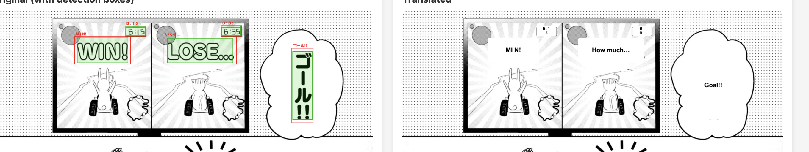
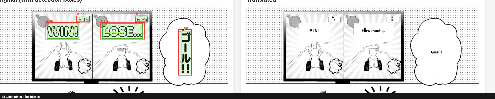
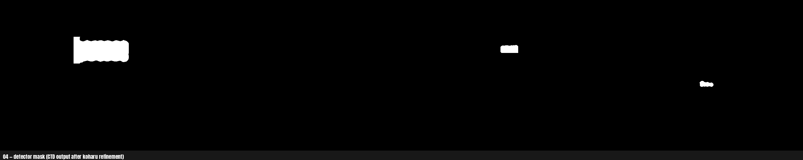
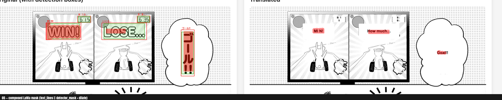
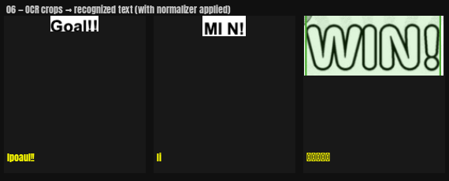
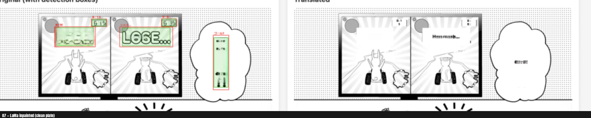
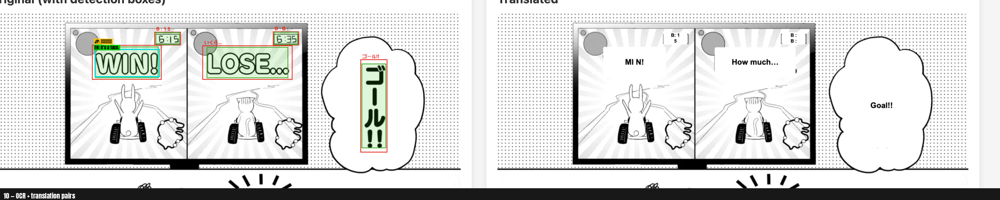
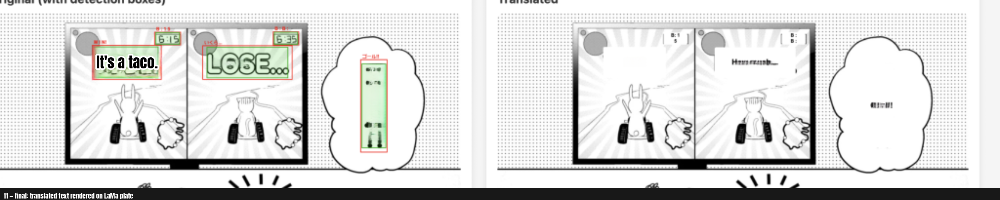

# End-to-end koharu pipeline gallery
Generated by `backend/scripts/visualize_e2e_pipeline.py`.
Each test page has 11 per-stage artefacts + OCR/translate text files.

## Per-feature demos

## Per-image galleries

### de (`de.png`)

- Blocks: **3**  Text lines: **5**
- Timings (ms): detect `853` · ocr `2424` · inpaint `14180` · translate `6284`

| # | JP (OCR) | EN (translate) |
|---|---|---|
| 1 | タコだ。。 | It’s a taco. |

