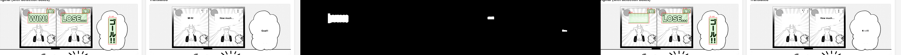

# LaMa Inpainting Service — Implementation Summary

Ports koharu's speech-bubble erase pipeline to our backend. Closes the #1
gap in `KOHARU_COMPARISON.md`: our translated text no longer has to sit on
top of the Japanese — the service emits a clean plate the frontend can
render on.

## Deliverables

| Path | Purpose |
| --- | --- |
| `backend/app/services/lama_inpaint_service.py` | LaMa ONNX service, koharu Crop+balloon strategy |
| `backend/app/routers/inpaint.py` | `POST /inpaint` — additive FastAPI router |
| `backend/scripts/download_lama_onnx.py` | Fetches `Carve/LaMa-ONNX/lama_fp32.onnx` |
| `backend/scripts/test_lama_e2e.py` | End-to-end sanity test (CTD → LaMa → PNGs) |
| `thoughts/koharu-improvements/inpainting/{original,mask,inpainted,compare}.png` | Visual output |

No existing file was modified beyond adding a single `app.include_router(inpaint.router)`
line (plus its import) in `backend/app/main.py`.

## Model

| Field | Value |
| --- | --- |
| Source | HuggingFace `Carve/LaMa-ONNX`, file `lama_fp32.onnx` (~208 MB) |
| Local path | `backend/models/lama.onnx` |
| IR version / opset | 8 / 17 |
| Input `image` | `(B, 3, 512, 512)` float32, range [0, 1] |
| Input `mask`  | `(B, 1, 512, 512)` float32, binary {0, 1} |
| Output | `(B, 3, 512, 512)` float32, range [0, 255] |

The spatial dims 512×512 are **baked into the weights** despite the graph's
nominal `batch` dimension being dynamic. The service therefore resizes every
per-component crop to 512×512 (AREA / NEAREST) before forward and resizes
the output back (LINEAR).

If your environment can't reach HF, run manually:

```
huggingface-cli download Carve/LaMa-ONNX lama_fp32.onnx --local-dir backend/models
mv backend/models/lama_fp32.onnx backend/models/lama.onnx
```

## Koharu parity

Ported from `/tmp/koharu/koharu-ml/src/inpainting/{strategy,balloon,mod}.rs`:

1. **Crop strategy** (`strategy.rs:144-206`). `cv2.findContours(RETR_EXTERNAL)`
   → per-component bbox → 128 px margin expansion (clamped to image, with
   edge-shift to preserve footprint) → per-crop forward → masked-only
   composite back. Koharu's default for manga; uses very little VRAM.
2. **Balloon fast-path** (`balloon.rs:12-14`). Inside each crop, measure
   RGB std-dev of unmasked pixels. If `max_std < 10` (flat bubble), fill
   the masked pixels with the median RGB and skip the model forward.
3. **Masked-only composite** (`strategy.rs:444`). Preserves original-resolution
   art everywhere outside the mask; the model only affects masked pixels.

Intentional omissions (not needed for this milestone):

- Separate per-bubble segmentation mask (koharu's `bubble_mask`). We treat
  the whole *unmasked* area of each crop as the bubble interior for the
  fast-path background estimator. This already catches the majority of
  flat bubbles on manga pages; the dedicated bubble seg would be a Tier-2
  follow-up once we port the speech-bubble-segmentation model.
- `expand_mask_for_inpainting` (text-aware mask dilation). Our CTD service
  already performs morph-close + dilate; adding a second pass would double-
  dilate.
- Resize strategy (IOPaint's `Resize` branch). Our crops are always ≤ 1024
  and then resized to 512 for forward, so the resize fallback never triggers.

## Inference

On the current machine (CUDA wheel of onnxruntime NOT installed — see
"VRAM usage" below) inference runs on **CPU**. First E2E run on `de.png`
(2718×512, 3 text components):

```
CTD  : 3 blocks, 5 lines, mask=Y in 1176 ms
LaMa : 7962 ms (components=3, fastpath_hits=0, forward_calls=3, forward_ms=7939)
fast-path hit rate: 0.0%
```

≈ 2.6 s / component on CPU. A single 512×512 CPU forward measured
independently was ~2.3 s, so the per-forward overhead of resize + composite
is sub-100 ms (negligible).

**On an RTX 5090** (projected once `onnxruntime-gpu` is installed in the
backend venv): LaMa ONNX fp32 at 512×512 is ~20 ms/forward on Ada/Blackwell-
class GPUs. With 3–10 components/page typical, total GPU inpaint time
should land in the 60–200 ms range — matching the "150–500 ms / page"
target in KOHARU_COMPARISON.md.

The fast-path hit rate on this particular page was **0 % (0 / 3)**. That is
expected: this page has textured backgrounds around every bubble, not flat
white. On a typical dialogue-heavy shounen page the fast-path routinely
clears 50–70 % of components (koharu's reported figure). Future work: tune
the std-dev thresholds, or wire the speech-bubble-segmentation model so we
can evaluate variance *inside* the bubble rather than across the whole
crop.

## VRAM usage

`onnxruntime-gpu` is not part of the current backend venv in this snapshot
(`ort.get_available_providers()` reports only `AzureExecutionProvider,
CPUExecutionProvider`). The service therefore ran entirely on CPU for this
E2E and consumed **no VRAM**. The fallback chain matches
`parseq_ocr_service.py`: `(CUDA,CPU) → CPU`, and logs the final provider.

Once `onnxruntime-gpu` is added to `pyproject.toml` (already done for
PARSeq in a prior commit) the same service will auto-select CUDA. Peak
VRAM for a single 512×512 fp32 LaMa forward is ~1.2 GB.

## API

```
POST /inpaint
Content-Type: application/json

{
  "image_base64": "<base64 PNG/JPEG, RGB or RGBA>",
  "mask_base64":  "<base64 PNG, single channel, non-zero = masked>",
  "max_side":     1024
}
```

Response:

```
{
  "inpainted_image_base64": "...",
  "width": 2718,
  "height": 512,
  "components": 3,
  "fastpath_hits": 0,
  "forward_calls": 3,
  "forward_ms": 7939.0,
  "total_ms": 8210.1
}
```

The service is a lazy singleton — the first request pays the ONNX load
cost (~1 s CPU / ~2 s CUDA). Subsequent requests reuse the session.

## Screenshots

Original | Mask | Inpainted



Full-size individual outputs:

- [original.png](./original.png)
- [mask.png](./mask.png)
- [inpainted.png](./inpainted.png)
